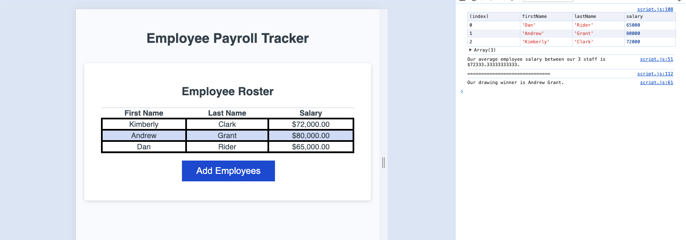

# Employee Payroll Tracker Starter Code

## Description:
This project helped to develop new areas of challenege to help learn a more logic-oriented mindset.

## Installation:
To install this repo, simply copy the repo and use git clone in your command line along with the copied repo url with your preferred method.

```bash
git clone git@github.com:andrewhamerly/payroll-tracker.git
```

## Usage
This can be used to add several employees along with their salary to a table while proving the average salary and a random drawing winner from the employees array.

Link to deployed application:
[Payroll Tracker](https://andrewhamerly.github.io/payroll-tracker/)




## Credits:
https://www.w3schools.com/jsref/met_win_confirm.asp

My instructor Micheal for helping to guide me through troubleshooting missing an object in my array.

## License:
Source code is licensed under the MIT license.